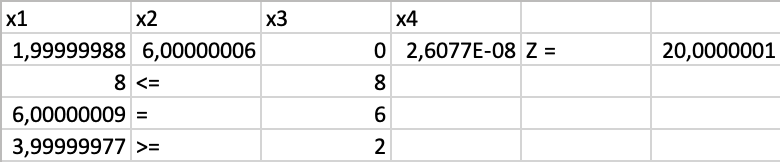

## Лабораторная работа 1

Персук Виктория Петровна, МЕТОПТ 1.1

### Реализация алгоритма решения задачи линейного программирования

Ниже представлен словестный псевдокод, объясняющий ход решения ЗЛП

```
1. Считать исходную задачу ЛП из текстового файла

2. Преобразовать задачу к каноническому виду:
    2.1. Все ограничения привести к уравнениям (добавление дополнительных переменных)
    2.2. Все переменные сделать неотрицательными

3. Сформировать вспомогательную задачу для поиска допустимого базиса:
    3.1. Если в условиях есть уравнения или ограничения ≥, добавить искусственные переменные

4. Решить вспомогательную задачу симплекс-методом:
    4.1. Если значение вспомогательной функции ≠ 0 — задача несовместна, выход

5. Перейти к решению исходной задачи симплекс-методом:
    5.1. Использовать найденный допустимый базис, исключить искусственные переменные

6. Получить оптимальное решение (или определить несовместность или неограниченность задачи)

7. Записать результат в файл, оформить понятный вывод (значения основных переменных, значение целевой функции, проверка ограничений)
```

### Запуск программы

Входные данные должны храниться в файле `.txt` в папке `examples/` (либо можно в файле `main.py` изменить путь до файла) и иметь следующий формат (пример):

```
max
Z = 1x1 + 3x2 + 2x3 + 1x4
x1 > 0, x2 > 0, x3 < 0, x4 > 0
1x1 + 1x2 + 2x4 <= 8
1x2 + 1x3 + 1x4 = 6
2x1 + 1x3 >= 2
```

Из корневой папки:

```bash
cd lab1
python main.py
```

Для проверки решения при помощи библиотеки `Scipy`:
```bash
cd lab1
python solve_with_scipy.py
```

Решение сохраняется в файл `.txt` в папку `examples/`

### Как работает программа

Программа выполнена в стиле функционального программирования. Каждая функция расположена в отдельном файле, итговый пайплайн представлен в файле `main.py`. Также определены модели для хранения параметров ЗЛП (`class LinearProblem`) и решения (`class Solution`) в файле `models.py`

При запуске `main.py` в терминал выводится следующий текст:


Решение сохраняется в `examples/` и имеет следующий вид:


Это решение для задачи из моего варианта, которая выглядит следующим образом


Если сравнить программное решение с решением при помощи готового решения `scipy`, то можно сделать вывод, что они совпадают (с точностью до округления)


### UPD:

- Добавлена возможность изменять ограничения на переменные (влияет на итоговое решение)
- Изменён вид input и output файлов

### Выводы

Программное решение ЗЛП, конечно, прикольное, интересно было посмотреть, что "под капотом", но в реальной жизни лучше использовать уже реализованые библиотеки (например, из `scipy`). Самое сложное было понять как лучше хранить и парсить данные, какую модель данных сделать, а написание самого алгоритма не составило труда
